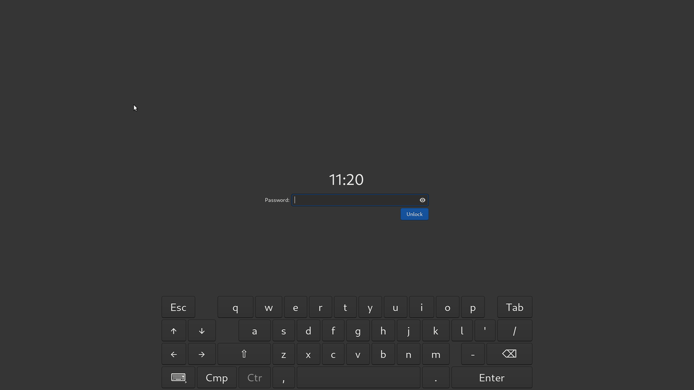

# gtklock-virtkb-module
gtklock module adding a keyboard to the lockscreen

## About
Adds a keyboard for password entry to the lockscreen.

The keyboard layout has been copied from [wvkbd](https://github.com/jjsullivan5196/wvkbd)

__⚠️ Module version matches the compatible gtklock version. Other versions might or might not work.__
## Dependencies
- GNU Make (build-time)
- pkg-config (build-time)
- gtk+3.0
